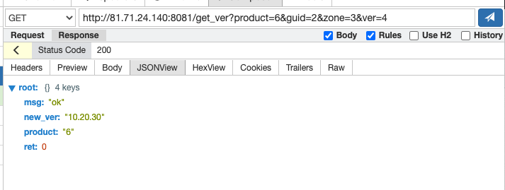

# 一、libevent 库 

libevent 版本： 2.1.12-stable

编译 

```sh
 ./configure && make 
```

编译完成后，把 include 和 .lib 拷贝出来。 放到 include 和 lib 中。

```sh 
[root@VM-0-15-centos libevent-module]# ls -al include/
总用量 36
drwxr-xr-x 3 root root 4096 12月 13 01:02 .
drwxr-xr-x 8 root root 4096 1月   4 14:00 ..
-rw-r--r-- 1 root root 2019 1月   4 16:14 evdns.h
drwxr-xr-x 2 root root 4096 12月 13 01:02 event2
-rw-r--r-- 1 root root 2744 1月   4 16:14 event.h
-rw-r--r-- 1 root root 2035 1月   4 16:14 evhttp.h
-rw-r--r-- 1 root root 2015 1月   4 16:14 evrpc.h
-rw-r--r-- 1 root root 1782 1月   4 16:14 evutil.h
-rw-r--r-- 1 root root 1468 1月   4 16:14 include.am

[root@VM-0-15-centos libevent-module]# ls -al lib/
总用量 5048
drwxr-xr-x 2 root root    4096 12月 13 01:03 .
drwxr-xr-x 8 root root    4096 1月   4 14:00 ..
-rw-r--r-- 1 root root 2455998 1月   4 16:14 libevent.a
-rw-r--r-- 1 root root 1565854 1月   4 16:14 libevent_core.a
-rw-r--r-- 1 root root  890218 1月   4 16:14 libevent_extra.a
-rw-r--r-- 1 root root  214346 1月   4 16:14 libevent_openssl.a
-rw-r--r-- 1 root root   21990 1月   4 16:14 libevent_pthreads.a
```

# 二、http 服务

http-server 是一个简单的 http 服务。 

大致流程是：

- `event_base_new()` 创建 libevent 基础事件。
- 注册信号处理， 方便服务退出。 
- `evhttp_new(base)` 创建 http 事件 。
- `evhttp_set_cb` 设置回调处理函数。
- 绑定端口 `evconnlistener_new_bind`。
- 监控端口 `evhttp_bind_listener`。
- 分发处理事件 `event_base_dispatch(base)`。

```c++
	// 创建基础事件 event_base_new
	base = event_base_new();
	if (!base){
		fprintf(stderr, "Error: careate event base failed.\n"); 
		return -1;
	}

	// 注册信号处理
	struct event evsignal;
	event_assign(&evsignal, base, SIGTERM, EV_SIGNAL|EV_PERSIST, SignalTermHandler, &evsignal);
	event_add(&evsignal, NULL);

	// 创建 http 事件
	struct evhttp *httpd = evhttp_new(base);
	if (!httpd){
		fprintf(stderr, "Error: create evthttp_new failed."); 		
		return -1;
	}

	// 设置回调
    evhttp_set_timeout(httpd, m_nTimeout);
	evhttp_set_cb(httpd, "/get_ver", GetVerCallBack, this);
	
    struct evhttp_bound_socket *pEvHttpHandle = NULL;
	struct evconnlistener * pEvListener       = NULL;

	struct sockaddr_in stSockAddr;
	memset(&stSockAddr, 0x0, sizeof(stSockAddr));
	stSockAddr.sin_family = AF_INET;
	stSockAddr.sin_addr.s_addr = m_nHost; // ip  
	stSockAddr.sin_port = htons(m_nPort); // port 

	// 绑定端口
	pEvListener = evconnlistener_new_bind(base, 
										NULL, 
										NULL,
										LEV_OPT_CLOSE_ON_FREE|LEV_OPT_REUSEABLE|LEV_OPT_CLOSE_ON_EXEC,
										1024,
										(struct sockaddr*)&stSockAddr, 
										sizeof(stSockAddr));
	if (pEvListener == NULL){
	    fprintf(stderr, "Error: create listener failed.\n"); 	
		return -1;
	}

	// 监控端口
	pEvHttpHandle = evhttp_bind_listener(httpd, pEvListener);
	if (pEvHttpHandle == NULL){
		fprintf(stderr, "Error: evhttp_bind_listener failed.\n");	
		return -1;
	}

	// 分发事件
	event_base_dispatch(base);
	evhttp_free(httpd);
	event_base_free(base);
```

服务启动 ： 

```sh 
./http-server http-server.ini
```

测试请求：



# 三、timer 定时器

timer 是一个定时服务。 每隔多少秒执行一次。

大致流程：

- 注册信号处理，方便服务退出。 
- 用 `event_assign()` 设置回调函数 TimeoutCallBack 。
- `event_add()` 添加事件。
- `event_base_dispatch(base)` 分发执行事件。

```c++
	// 注册信号处理
	struct event evsignal;
	event_assign(&evsignal, base, SIGTERM, EV_SIGNAL|EV_PERSIST, SignalCallBack, &evsignal);
	event_add(&evsignal, NULL);

    int flags = 0;
    struct event timeout;
	struct timeval tv;

	// Initalize one event 
	event_assign(&timeout, base, -1, flags, TimeoutCallBack, (void*) &timeout);
	
    evutil_timerclear(&tv);
	tv.tv_sec = interval;
	event_add(&timeout, &tv);
    evutil_gettimeofday(&lasttime, NULL);

	// 分发事件
	event_base_dispatch(base);
	event_base_free(base);
```

注意 : flags = 0 时，事件激活后，要重新设置一下。

```c++
void CTimerProc::TimeoutCallBack(evutil_socket_t fd, short event, void *arg)
{
	struct event *timeout = (struct event *)arg;
	
    Handler(fd, event, timeout); // 任务处理

	struct timeval tv;
	evutil_timerclear(&tv);
	tv.tv_sec = interval;
	event_add(timeout, &tv); // 重新设置一下
}
```

可参考源码：event.h

```c
/**
 * Persistent event: won't get removed automatically when activated.
 *
 * When a persistent event with a timeout becomes activated, its timeout
 * is reset to 0.
 */
#define EV_PERSIST	0x10
```

定时服务启动后：

```sh 
[root@VM-0-15-centos timer]# ./timer-deamon timer.ini
[root@VM-0-15-centos timer]# Timer Info:Timeout=3
Info : TimeoutCallBack called at 1672844628: 3.003 seconds elapsed.
Info : TimeoutCallBack called at 1672844631: 3.003 seconds elapsed.
Info : TimeoutCallBack called at 1672844634: 3.003 seconds elapsed.
Info : TimeoutCallBack called at 1672844637: 3.001 seconds elapsed.
Info : TimeoutCallBack called at 1672844640: 3.003 seconds elapsed.
Info : TimeoutCallBack called at 1672844643: 3.003 seconds elapsed.
```
 


